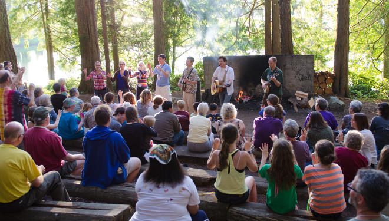

# What is Eliot?

<figure>
    
    <figcaption>Songs at Firelight</figcaption>
</figure>

It's a **summer camp** for people of all ages, filled with laughter, 
singalongs, swimming in the lagoon, talent shows, and group meals in the dining hall.

It's a **retreat**, with thought-provoking morning programs followed by small group 
discussions, and additional opportunities to explore social justice issues.

It's an opportunity for **spiritual connection**, with worship services each evening.

It's a chance to express **creativity** - explore music in choir, rock band and 
coffeehouse performances, learn a new visual art, dance, or tie-dye.

It's a safe space for **personal growth**, from the profound to the silly.

It's a time to enjoy **nature-walk** in the woods, watch the sunset, listen 
to the birds, and look for shells on the shore of Hood Canal.

It's a **]multi-generational community** of people who find their happy place at Seabeck Conference Center.

**Eliot is all of these things and more!**

Learn more in our <a href="?info=introduction">Introduction to Camp</a>.
